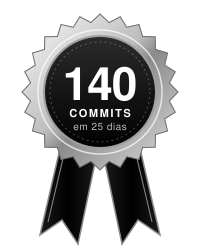
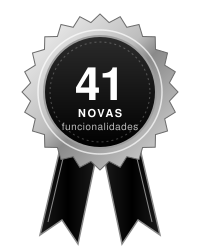
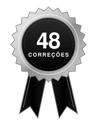

<a href="https://wa.me/5527996240725">
<picture>
  <source media="(prefers-color-scheme: dark)" srcset="https://readme-typing-svg.demolab.com?font=JetBrains+Mono&weight=500&size=20&pause=1200&center=true&vCenter=true&width=720&height=40&repeat=true&lines=Construo%20sites%2C%20aplicativos%20e%20automa%C3%A7%C3%B5es;Laravel%20%C2%B7%20PHP%20%C2%B7%20MySQL%20%C2%B7%20Queues;Python%20%C2%B7%20IA;TypeScript%20%C2%B7%20Deno%20%C2%B7%20C%2B%2B;Bora%20tirar%20sua%20ideia%20do%20papel%3F&color=FFFFFF" />
  
</picture>
</a>

 

 

<picture><source media="(prefers-color-scheme: dark)" srcset="https://capsule-render.vercel.app/api?type=rect&color=0:000000%2C100:3a3a3a&height=42&section=header&text=Projetos%20que%20eu%20trabalho%20hoje&fontSize=20&fontColor=ffffff&fontAlign=50&fontAlignY=55" /></picture>

### [Mestre Oficina](https://mestreoficina.com.br)
*Sistema de gestão para oficinas mecânicas: ordem de serviço digital, lembretes automáticos no WhatsApp e nota fiscal em 1 clique.*

 

<picture><source media="(prefers-color-scheme: dark)" srcset="https://capsule-render.vercel.app/api?type=rect&color=0:000000%2C100:3a3a3a&height=42&section=header&text=Projetos%20pessoais&fontSize=20&fontColor=ffffff&fontAlign=50&fontAlignY=55" /></picture>

<table>
<tr>
<td width="50%" valign="top">
<h3><a href="https://github.com/MatheusGustav/mister">mister</a></h3>
 

<em>Assistente pessoal com IA que roda no terminal.</em>

<ul>
<li>A IA escolhe o que fazer; ferramentas escritas em código executam</li>
<li>Ação perigosa só roda depois que eu confirmo</li>
<li>Memória com busca por significado, com embeddings locais</li>
<li>Até 4 ações por resposta, com detector de loop</li>
<li>Manda arquivos pro celular usando o ekodide</li>
</ul>
</td>
<td width="50%" valign="top">
<h3><a href="https://github.com/MatheusGustav/colibri">colibri</a></h3>
 

<em>Qwen3.6-35B-A3B rodando num notebook de 12 GB, sem placa de vídeo.</em>

<ul>
<li>Pico de RAM caiu de <b>8,7 GB para 4,8 GB</b></li>
<li>Leitura do prompt <b>~4x</b> mais rápida, resposta <b>~2x</b></li>
<li>Tudo opcional: desligado, o resultado é idêntico ao original</li>
</ul>
</td>
</tr>
<tr>
<td width="50%" valign="top">
<h3><a href="https://github.com/MatheusGustav/ekodide">ekodide</a></h3>
 

<em>Transferência de arquivos pela rede local, cifrada e autenticada.</em>

<ul>
<li>Criptografia AES-256-GCM + autenticação HMAC</li>
<li>O arquivo chega idêntico, byte a byte</li>
<li>Aparelhos se acham sozinhos na rede e pareiam por frase-código</li>
<li>CLI em Python com 1 dependência + app Android em Kotlin</li>
</ul>
</td>
<td width="50%" valign="top">
<h3><a href="https://github.com/MatheusGustav/webhook-pagamentos">webhook-pagamentos</a></h3>
  

<em>Cria a cobrança e confirma o pagamento com segurança: InfinitePay e Mercado Pago.</em>

<ul>
<li>Reconfere na API do gateway, não confia só no aviso</li>
<li>Não confirma o mesmo pagamento duas vezes</li>
<li>Avisa no Telegram cada venda e cada problema</li>
<li>Saiu de código em produção. <a href="https://wa.me/5527996240725">Eu instalo no seu projeto</a></li>
</ul>
</td>
</tr>
</table>

 

<picture><source media="(prefers-color-scheme: dark)" srcset="https://capsule-render.vercel.app/api?type=rect&color=0:000000%2C100:3a3a3a&height=42&section=header&text=Stack&fontSize=20&fontColor=ffffff&fontAlign=50&fontAlignY=55" /></picture>

<table>
  <tr>
    <td align="right"><b>Backend</b></td>
    <td>
<picture><source media="(prefers-color-scheme: dark)" srcset="https://cdn.simpleicons.org/php/ffffff" /></picture>&nbsp;&nbsp;
<picture><source media="(prefers-color-scheme: dark)" srcset="https://cdn.simpleicons.org/laravel/ffffff" /></picture>&nbsp;&nbsp;
<picture><source media="(prefers-color-scheme: dark)" srcset="https://cdn.simpleicons.org/python/ffffff" /></picture>&nbsp;&nbsp;
<picture><source media="(prefers-color-scheme: dark)" srcset="https://cdn.simpleicons.org/nodedotjs/ffffff" /></picture>&nbsp;&nbsp;
<picture><source media="(prefers-color-scheme: dark)" srcset="https://cdn.simpleicons.org/deno/ffffff" /></picture>&nbsp;&nbsp;
<picture><source media="(prefers-color-scheme: dark)" srcset="https://cdn.simpleicons.org/mysql/ffffff" /></picture>&nbsp;&nbsp;
<picture><source media="(prefers-color-scheme: dark)" srcset="https://cdn.simpleicons.org/postgresql/ffffff" /></picture>&nbsp;&nbsp;
    </td>
  </tr>
  <tr>
    <td align="right"><b>Frontend</b></td>
    <td>
<picture><source media="(prefers-color-scheme: dark)" srcset="https://cdn.simpleicons.org/html5/ffffff" /></picture>&nbsp;&nbsp;
<picture><source media="(prefers-color-scheme: dark)" srcset="https://cdn.simpleicons.org/css/ffffff" /></picture>&nbsp;&nbsp;
<picture><source media="(prefers-color-scheme: dark)" srcset="https://cdn.simpleicons.org/javascript/ffffff" /></picture>&nbsp;&nbsp;
<picture><source media="(prefers-color-scheme: dark)" srcset="https://cdn.simpleicons.org/typescript/ffffff" /></picture>&nbsp;&nbsp;
<picture><source media="(prefers-color-scheme: dark)" srcset="https://cdn.simpleicons.org/react/ffffff" /></picture>&nbsp;&nbsp;
<picture><source media="(prefers-color-scheme: dark)" srcset="https://cdn.simpleicons.org/nextdotjs/ffffff" /></picture>&nbsp;&nbsp;
<picture><source media="(prefers-color-scheme: dark)" srcset="https://cdn.simpleicons.org/vite/ffffff" /></picture>&nbsp;&nbsp;
<picture><source media="(prefers-color-scheme: dark)" srcset="https://cdn.simpleicons.org/alpinedotjs/ffffff" /></picture>&nbsp;&nbsp;
<picture><source media="(prefers-color-scheme: dark)" srcset="https://cdn.simpleicons.org/animedotjs/ffffff" /></picture>&nbsp;&nbsp;
    </td>
  </tr>
  <tr>
    <td align="right"><b>Outras linguagens</b></td>
    <td>
<picture><source media="(prefers-color-scheme: dark)" srcset="https://cdn.simpleicons.org/kotlin/ffffff" /></picture>&nbsp;&nbsp;
<picture><source media="(prefers-color-scheme: dark)" srcset="https://cdn.simpleicons.org/c/ffffff" /></picture>&nbsp;&nbsp;
<picture><source media="(prefers-color-scheme: dark)" srcset="https://cdn.simpleicons.org/cplusplus/ffffff" /></picture>&nbsp;&nbsp;
<picture><source media="(prefers-color-scheme: dark)" srcset="https://cdn.simpleicons.org/gnubash/ffffff" /></picture>&nbsp;&nbsp;
    </td>
  </tr>
  <tr>
    <td align="right"><b>DevOps</b></td>
    <td>
<picture><source media="(prefers-color-scheme: dark)" srcset="https://cdn.simpleicons.org/git/ffffff" /></picture>&nbsp;&nbsp;
<picture><source media="(prefers-color-scheme: dark)" srcset="https://cdn.simpleicons.org/githubactions/ffffff" /></picture>&nbsp;&nbsp;
<picture><source media="(prefers-color-scheme: dark)" srcset="https://cdn.simpleicons.org/docker/ffffff" /></picture>&nbsp;&nbsp;
<picture><source media="(prefers-color-scheme: dark)" srcset="https://cdn.simpleicons.org/kubernetes/ffffff" /></picture>&nbsp;&nbsp;
<picture><source media="(prefers-color-scheme: dark)" srcset="https://cdn.simpleicons.org/n8n/ffffff" /></picture>&nbsp;&nbsp;
<picture><source media="(prefers-color-scheme: dark)" srcset="https://cdn.simpleicons.org/cloudflare/ffffff" /></picture>&nbsp;&nbsp;
<picture><source media="(prefers-color-scheme: dark)" srcset="https://cdn.simpleicons.org/linux/ffffff" /></picture>&nbsp;&nbsp;
    </td>
  </tr>
</table>

 

<picture><source media="(prefers-color-scheme: dark)" srcset="https://capsule-render.vercel.app/api?type=rect&color=0:000000%2C100:3a3a3a&height=42&section=header&text=GitHub%20em%20n%C3%BAmeros&fontSize=20&fontColor=ffffff&fontAlign=50&fontAlignY=55" /></picture>

<picture>
  <source media="(prefers-color-scheme: dark)" srcset="https://github-readme-streak-stats.herokuapp.com/?user=MatheusGustav&locale=pt_br&hide_border=true&background=00000000&ring=FFFFFF&fire=FFFFFF&currStreakNum=FFFFFF&sideNums=FFFFFF&currStreakLabel=FFFFFF&sideLabels=DDDDDD&dates=888888&stroke=888888" />
  
</picture>

  

<picture>
  <source media="(prefers-color-scheme: dark)" srcset="https://raw.githubusercontent.com/MatheusGustav/MatheusGustav/output/pacman-contribution-graph-dark.svg" />
  
</picture>

 

<picture><source media="(prefers-color-scheme: dark)" srcset="https://capsule-render.vercel.app/api?type=rect&color=0:000000%2C100:3a3a3a&height=42&section=header&text=Vamos%20conversar%3F&fontSize=20&fontColor=ffffff&fontAlign=50&fontAlignY=55" /></picture>

 

  

<picture>
  <source media="(prefers-color-scheme: dark)" srcset="https://readme-typing-svg.demolab.com?font=JetBrains+Mono&weight=400&size=16&pause=1200&center=true&vCenter=true&width=520&height=30&repeat=true&lines=Obrigado%20pela%20visita%21;Bora%20construir%20algo%20juntos%3F&color=FFFFFF" />
  
</picture>

